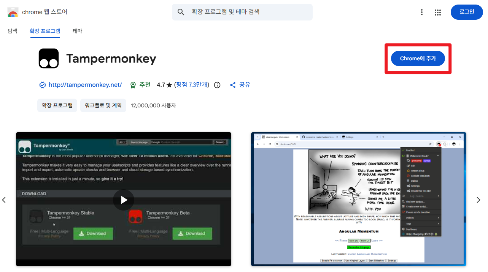
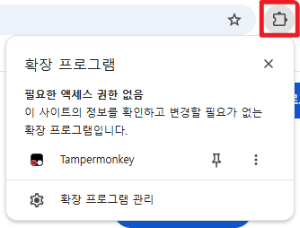
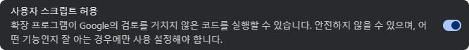
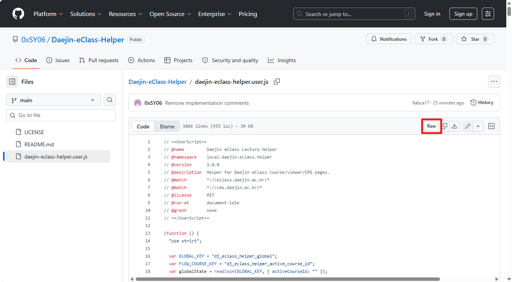
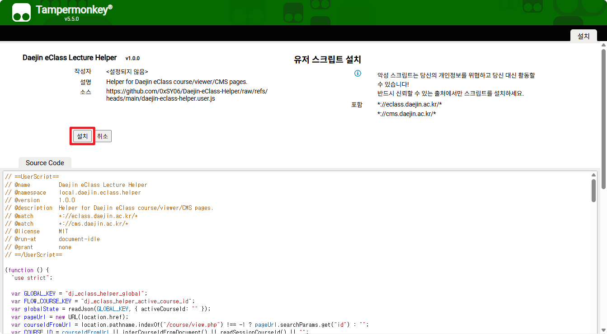
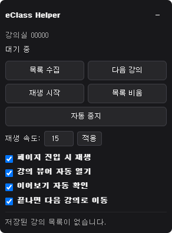

# Daejin eClass Lecture Helper

대진대학교 eClass 강의 페이지와 CMS 강의 시청 페이지에서 강의 재생 흐름을 보조하는 Tampermonkey 유저스크립트입니다.

## 버전

현재 버전: `1.1.0`

### 최근 업데이트

- 패널에서 `1~15` 사이의 재생 속도를 설정할 수 있습니다.
- 강의 뷰어와 플레이어에서 재생 시작을 시도하는 로직을 보강했습니다.

## 설치 전 준비

이 스크립트를 사용하려면 브라우저에 Tampermonkey를 설치하고, Chrome / Edge 환경에서는 유저스크립트 실행 허용 설정을 확인해야 합니다.

## 1. Tampermonkey 설치

Chrome / Edge 사용자는 Chrome 웹스토어에서 Tampermonkey를 바로 설치할 수 있습니다.

1. 아래 Chrome 웹스토어 Tampermonkey 페이지에 접속합니다.

   https://chromewebstore.google.com/detail/tampermonkey/dhdgffkkebhmkfjojejmpbldmpobfkfo?hl=ko

2. `Chrome에 추가` 버튼을 누릅니다.
3. 설치 확인 창이 뜨면 확장 프로그램 추가를 진행합니다.
4. 설치가 끝나면 브라우저 오른쪽 위의 확장 프로그램 영역에서 Tampermonkey를 확인합니다.

Tampermonkey 공식 사이트에서도 브라우저별 설치 페이지로 이동할 수 있습니다.

https://www.tampermonkey.net/

## 2. Tampermonkey 아이콘 찾기

Tampermonkey를 설치해도 브라우저 오른쪽 위에 아이콘이 바로 보이지 않을 수 있습니다.

1. 브라우저 오른쪽 위의 퍼즐 조각 모양 `확장 프로그램` 아이콘을 누릅니다.
2. 확장 프로그램 목록에서 `Tampermonkey`를 찾습니다.
3. Tampermonkey 옆의 핀 아이콘을 누르면 브라우저 상단에 고정됩니다.

아이콘을 고정하지 않아도 사용할 수 있지만, 대시보드에 들어가기 편하도록 고정하는 것을 권장합니다.

## 3. 유저스크립트 실행 허용 설정

최신 Chrome / Edge 환경에서는 Tampermonkey에서 유저스크립트를 실행하려면 추가 설정이 필요할 수 있습니다.

### Chrome

1. 주소창에 아래 주소를 입력합니다.

   `chrome://extensions/`

2. `Tampermonkey`를 찾고 `세부정보`를 누릅니다.
3. `사용자 스크립트 허용` 항목이 있으면 켭니다.
4. `사용자 스크립트 허용` 항목이 보이지 않거나 스크립트가 실행되지 않으면, 확장 프로그램 페이지 오른쪽 위의 `개발자 모드`를 켭니다.
5. Tampermonkey가 활성화되어 있는지 확인합니다.

### Edge

1. 주소창에 아래 주소를 입력합니다.

   `edge://extensions/`

2. `Tampermonkey`를 찾고 `세부정보`를 누릅니다.
3. `사용자 스크립트 허용` 항목이 있으면 켭니다.
4. `사용자 스크립트 허용` 항목이 보이지 않거나 스크립트가 실행되지 않으면, 확장 프로그램 페이지의 `개발자 모드`를 켭니다.
5. Tampermonkey가 활성화되어 있는지 확인합니다.

## 4. 사이트 액세스 권한 확인

스크립트가 실행되지 않는 경우 Tampermonkey의 사이트 액세스 권한을 확인합니다.

1. 주소창에 `chrome://extensions/` 또는 `edge://extensions/`를 입력합니다.
2. `Tampermonkey` 항목의 `세부정보`를 누릅니다.
3. `사이트 액세스` 또는 `사이트 권한` 항목을 확인합니다.
4. 권한이 제한되어 있다면 `모든 사이트에서` 또는 eClass/CMS 사이트에서 실행되도록 변경합니다.

이 스크립트가 사용하는 사이트는 아래와 같습니다.

- `https://eclass.daejin.ac.kr/*`
- `https://cms.daejin.ac.kr/*`

## 5. 스크립트 설치 방법

1. 이 저장소에서 `daejin-eclass-helper.user.js` 파일을 엽니다.
2. 파일 화면에서 `Raw` 버튼을 누릅니다.
   `Raw`는 GitHub에서 스크립트 원본 파일을 그대로 여는 버튼입니다.
3. Tampermonkey 설치 화면이 자동으로 열리면 `설치` 버튼을 누릅니다.
4. 설치 후 Tampermonkey 대시보드에 `Daejin eClass Lecture Helper`가 표시되면 완료입니다.

자동 설치 화면이 뜨지 않는 경우:

1. 브라우저 오른쪽 위의 Tampermonkey 아이콘을 누릅니다.
2. Tampermonkey 아이콘이 보이지 않으면 퍼즐 조각 모양 `확장 프로그램` 아이콘을 누른 뒤 `Tampermonkey`를 선택합니다.
3. `대시보드`로 이동합니다.
4. `+` 버튼을 눌러 새 스크립트를 만듭니다.
5. 기존 내용을 모두 지우고 `daejin-eclass-helper.user.js` 내용을 붙여넣습니다.
6. 저장합니다.

## 6. 사용 방법

1. 대진대학교 eClass에 로그인합니다.
2. 강의가 있는 과목 페이지로 이동합니다.
3. 화면 오른쪽 아래에 `eClass Helper` 패널이 표시됩니다.
4. `목록 수집` 버튼으로 강의 목록을 수집합니다.
5. 필요한 옵션을 켜거나 끕니다.
6. 강의 시청 페이지 또는 뷰어에서 자동 재생과 다음 강의 이동 기능을 사용할 수 있습니다.

## 패널 버튼

- `목록 수집`: 현재 과목 페이지에서 강의 목록을 수집합니다.
- `다음 강의`: 저장된 목록에서 다음 강의로 이동합니다.
- `재생 시작`: 현재 강의 뷰어 또는 플레이어에서 재생을 시도합니다.
- `목록 비움`: 저장된 강의 목록을 비웁니다.
- `자동 중지`: 자동 재생, 뷰어 자동 열기, 이어보기 자동 확인, 다음 강의 이동을 모두 끕니다.

## 옵션

- `재생 속도`: 강의 영상의 재생 배속을 설정합니다. `1`부터 `15`까지 입력할 수 있습니다.
- `페이지 진입 시 재생`: 강의 뷰어 또는 CMS 페이지에 들어가면 재생을 시도합니다.
- `강의 뷰어 자동 열기`: 강의 페이지에서 실제 시청 뷰어를 자동으로 엽니다.
- `이어보기 자동 확인`: 이전 시청 기록이 있을 때 이어보기 확인 창을 자동으로 수락합니다.
- `끝나면 다음 강의로 이동`: 강의 재생이 끝난 것으로 감지되면 다음 강의로 이동합니다.

## 주요 기능

- 과목 페이지에서 강의 목록 수집
- 강의 뷰어 자동 열기
- 강의 재생 자동 시작
- 재생 속도 조절
- 설정한 배속 자동 유지
- 이어보기 확인 자동 처리
- 강의 종료 감지 후 다음 강의 이동
- 강의별 진행 목록 관리
- 음소거 적용

## 지원 페이지

이 스크립트는 아래 주소에서 동작합니다.

- `https://eclass.daejin.ac.kr/*`
- `https://cms.daejin.ac.kr/*`

단, 패널은 주로 eClass 과목 페이지와 일부 eClass 뷰어 페이지에서 표시됩니다. CMS 페이지에서는 재생 보조 기능이 중심으로 동작합니다.

## 문제 해결

### Tampermonkey 아이콘이 보이지 않는 경우

1. 브라우저 오른쪽 위의 퍼즐 조각 모양 `확장 프로그램` 아이콘을 누릅니다.
2. 목록에서 `Tampermonkey`를 찾습니다.
3. Tampermonkey 옆의 핀 아이콘을 눌러 상단에 고정합니다.
4. 그래도 보이지 않으면 `chrome://extensions/` 또는 `edge://extensions/`에서 Tampermonkey가 설치 및 활성화되어 있는지 확인합니다.

### 스크립트가 실행되지 않는 경우

아래 항목을 순서대로 확인합니다.

1. Tampermonkey가 설치되어 있는지 확인합니다.
2. 브라우저 확장 프로그램 페이지에서 Tampermonkey가 활성화되어 있는지 확인합니다.
3. `사용자 스크립트 허용`이 켜져 있는지 확인합니다.
4. 필요한 경우 `개발자 모드`를 켭니다.
5. Tampermonkey의 사이트 액세스 권한이 허용되어 있는지 확인합니다.
6. Tampermonkey 대시보드에서 `Daejin eClass Lecture Helper`가 활성화되어 있는지 확인합니다.
7. 현재 접속한 주소가 `eclass.daejin.ac.kr` 또는 `cms.daejin.ac.kr`인지 확인합니다.
8. 페이지를 새로고침합니다.

### Raw 버튼을 눌러도 설치 화면이 뜨지 않는 경우

1. `daejin-eclass-helper.user.js` 파일 내용을 직접 복사합니다.
2. Tampermonkey 대시보드에서 새 스크립트를 만듭니다.
3. 기존 내용을 지우고 복사한 내용을 붙여넣습니다.
4. 저장합니다.

## 주의사항

- 이 스크립트는 개인 사용을 목적으로 합니다.
- 학교 시스템 구조가 변경되면 일부 기능이 동작하지 않을 수 있습니다.
- 브라우저, Tampermonkey, eClass 페이지 상태에 따라 자동 재생이 제한될 수 있습니다.
- 강의 수강 및 출석 인정 여부는 학교 시스템 기준을 따릅니다.

## 삭제 방법

1. 브라우저 오른쪽 위의 Tampermonkey 아이콘을 누릅니다.
2. Tampermonkey 아이콘이 보이지 않으면 퍼즐 조각 모양 `확장 프로그램` 아이콘을 누른 뒤 `Tampermonkey`를 선택합니다.
3. `대시보드`로 이동합니다.
4. `Daejin eClass Lecture Helper` 항목을 찾습니다.
5. 삭제 버튼을 눌러 스크립트를 제거합니다.

## 라이선스

이 프로젝트는 MIT License를 따릅니다.
